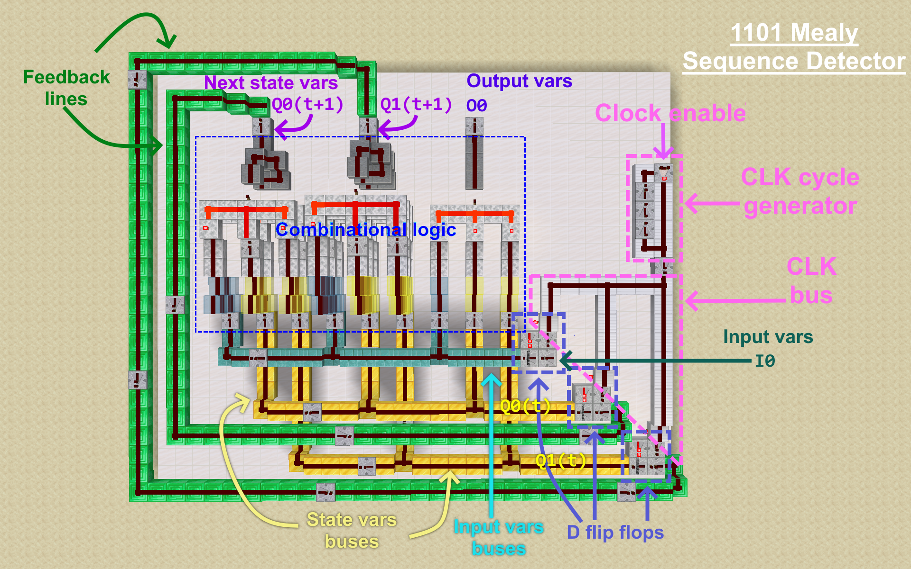

# FSM-Redstone-Synthesizer

A tool to automatically synthesize **Finite State Machines (FSM)** as Minecraft Redstone circuits.

Instead of manually wiring the logic for complex Redstone contraptions, you can simply describe your machine's state transitions in a JSON file and this program will generate a control unit for you in a schematic file, that can be easily placed in your Minecraft world.

## Features
- **Logic minimization:** Highly optimized logic is generated using the Espresso algorithm (implemented in the `pyeda` library), to generate logic blocks that implement the combinational logic for calculating the output variables and what the state variables should be on the next rising edge of the clock.

- **Human-readable JSON:** The states, inputs and outputs are defined using string names. So, confusion with bit arrays is avoided.

- **Generate complete Mealy or Moore machines:** This program can generate Mealy or Moore FSMs. These control units are then meant to be hooked up to other components at the external input and output pins. Note that Mealy outputs may be subject to transient logic hazards (flickering), so manual in-game verification is recommended to ensure timing stability for specific applications.

- **Export as ready-to-paste schematics:** The generated output files are `.litematic`, and require [Litematica mod](https://modrinth.com/mod/litematica) to be pasted in the world. Currently, only Litematica for Minecraft Java Edition is supported, thanks to the `litemapy` library.

- **Wide compatibility:** All the generated circuits use only standard game mechanics. The only Redstone components used being wires, torches, repeaters and comparators. So, while, at the current moment, this was tested on Minecraft Java Edition `1.21.4`, it is expected to be compatible with any modern Minecraft version that has the Litematica mod available. 

## Hardware architecture
The synthesizer generates a standard digital logic layout:
- **D flip-flops**: They store the machine's state and the last captured external inputs.

- **Input buses**: They carry the signals from the D flip-flops outputs to the combinational logic towers.

- **Combinational logic**: Dedicated logic towers for state transitions and external output variables.

- **Feedback lines**: Route computed next state signals from the logic towers back to their corresponding D flip-flops to update the machine state.

- **Clock bus**: Distributes a stable 50% duty cycle signal to synchronize all the D flip-flops.

Resulting building example:


## Using with Docker on Linux
The easiest way to deploy this on Linux-based systems is using Docker
1. Clone the repository and navigate into its directory:
```bash
git clone https://github.com/chiracristian/FSM-Redstone-Synthesizer.git
cd FSM-Redstone-Synthesizer
```

2. Build the Docker image:
```bash
./build_container.sh
```

3. To use, launch the `run_container.sh` script, as in this given example:
```bash
./run_container.sh examples/1101_sequence_detector.json output/1101.litematic
```

## Local installation on Linux
1. Clone the repository and navigate into its directory:
```bash
git clone https://github.com/chiracristian/FSM-Redstone-Synthesizer.git
cd FSM-Redstone-Synthesizer
```

2. Setup a python `venv`:
```bash
python3 -m venv .venv
source .venv/bin/activate
pip install -r requirements.txt
```

3. To use, run the `build_fsm.py` script, like in this example
```bash
python3 build_fsm.py examples/1101_sequence_detector.json output/1101_detector.litematic
```

## Example JSON for defining a FSM
Here is an example of a JSON that implements a Mealy FSM that detects the `1101` sequence in the input, outputting a `1` as soon as it is detected.

```json
{
    "info": {
        "name": "1101_sequence_detector",
        "description": "A Mealy machine that detects 1101 input sequence and outputs 1 as soon the sequence is detected. Overlapping sequences are accepted."
    },
    "config": {
        "num_inputs": 1,
        "num_state_vars": 2,
        "num_outputs": 1
    },

    "input_names": [
        {"no_input": [0]},
        {"enabled_input": [1]}
    ],
    "state_names": [
        {"initial": [0, 0]},
        {"entered_1": [0, 1]},
        {"entered_11": [1, 0]},
        {"entered_110": [1, 1]}
    ],
    "output_names": [
        {"no_output": [0]},
        {"enabled_output": [1]}
    ],

    "table": [
        { "input": "no_input", "state_t": "initial", "state_next": "initial", "output": "no_output" },
        { "input": "enabled_input", "state_t": "initial", "state_next": "entered_1", "output": "no_output" },

        { "input": "no_input", "state_t": "entered_1", "state_next": "initial", "output": "no_output" },
        { "input": "enabled_input", "state_t": "entered_1", "state_next": "entered_11", "output": "no_output" },

        { "input": "no_input", "state_t": "entered_11", "state_next": "entered_110", "output": "no_output" },
        { "input": "enabled_input", "state_t": "entered_11", "state_next": "entered_11", "output": "no_output" },

        { "input": "no_input", "state_t": "entered_110", "state_next": "initial", "output": "no_output" },
        { "input": "enabled_input", "state_t": "entered_110", "state_next": "entered_1", "output": "enabled_output" }
    ]
}
```

## Known issues and potential improvements (feel free to contribute!)
- Supports up to 14 total variables (inputs + state). Current combinational logic towers lack signal repeaters on long input lines, so their width is limited due to signal decay.
- The block-storage logic is format-agnostic. So, exporters for vanilla structure blocks or other schematic mods (maybe even some supporting other Minecraft editions, like the Bedrock Edition) could be added.
- Add the possibility to change the base blocks in a separate configuration file, without having to edit `src/blocks.py`.
- Find a more optimal layout for the feedback lines (currently they contribute the biggest delay).
- Equalize the delays of all the input buses, respectively the feedback lines, to increase the stability of Mealy machines.
- Develop a GUI for visually designing transition diagrams, removing the need for direct JSON editing.
